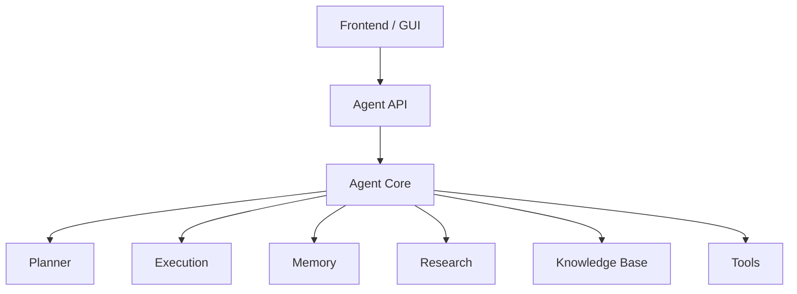

# GUI Architecture

This document describes the generation-3.5 desktop UI.

## Goals

- Keep the GUI fully separated from the agent core.
- Expose a single API layer between UI and agent.
- Support dockable, modular panels.
- Make it easy to add new panels without changing the main window.

## Top-level flow

## Main parts

### `api/agent_api.py`
The only bridge between GUI and core. It provides:

- message sending and response streaming
- planner snapshots
- memory snapshots
- research snapshots
- tool logs
- task state
- knowledge state
- settings

### `gui/main_window.py`
Owns the main application window and the dock layout.

The main window discovers panels through a registry and creates them dynamically.

### `gui/panel_registry.py`
Registers panels with metadata:

- panel name
- title
- dock area
- central vs. docked placement

### `gui/chat_panel.py`
Central chat surface with markdown rendering and streaming updates.

### `gui/planner_panel.py`
Shows the current goal, steps, current step, errors, and reflection.

### `gui/tool_panel.py`
Shows tool calls with status and runtime.

### `gui/memory_panel.py`
Shows facts and summaries, supports search, edit, delete, and semantic lookup.

### `gui/research_panel.py`
Shows query, source list, citations, and research context.

### `gui/knowledge_panel.py`
Shows documents, chunks, and retrieval results.

### `gui/task_panel.py`
Shows long-running tasks and scheduler-like state.

### `gui/logs_panel.py`
Shows logs by subsystem and allows export.

### `gui/settings_panel.py`
Edits persistent settings for the agent and UI.

## Extension model

New panels can be added by:

1. creating a new `gui/<panel>.py`
2. registering the widget with `register_panel(...)`
3. importing the module through the panel loader

No main-window rewrite is needed for new panels.

## Docking behavior

Panels can be:

- shown or hidden
- moved between dock areas
- floated as separate windows
- resized by the user

## Notes

- The agent core stays UI-free.
- The GUI does not call internal agent objects directly.
- All state access goes through the API layer.
