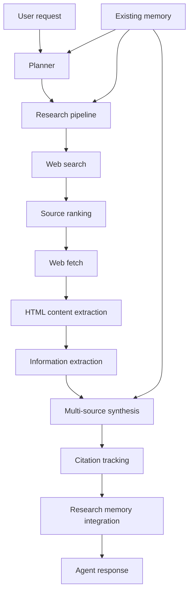

# Research Architecture

This document describes the generation-2.5 research stack.

## Goals

- Turn search results into actual source-backed research.
- Rank and validate sources before using them.
- Extract structured facts from fetched pages.
- Synthesize multiple sources without inventing unsupported claims.
- Track every external claim back to a source.
- Persist only long-term or preference-related research memories.

## High-level flow

## Components

### `tools/web_fetch.py`
Fetches a URL, applies timeout handling, and returns structured content.

### `research/html_parser.py`
Removes navigation, boilerplate, scripts, styles, and ad-like sections while extracting readable text and page titles.

### `research/source_ranker.py`
Scores sources by reliability, relevance, freshness, and completeness.

### `research/extractor.py`
Uses an LLM to extract structured facts from a source and validates the output.

### `research/synthesizer.py`
Combines several sources into a single answer, highlighting contradictions and uncertainty.

### `research/citations.py`
Stores claim-to-source mappings with timestamps and confidence.

### `research/memory_integration.py`
Persists only long-term research knowledge such as user preferences or explicitly requested notes.

## Output contract

The pipeline returns a structured result with:

- `summary`
- `sources_used`
- `citations`
- `confidence`
- `research_context`
- `memory_actions`

## Practical rule

Search snippets are only source hints.
The answer should be based on fetched page content, extracted facts, and synthesized evidence.
